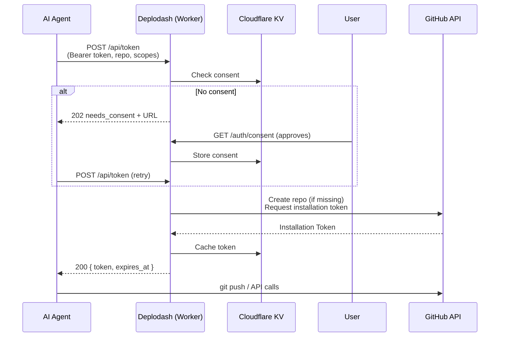

# 🤖 Deplodash — GitHub App Token Service

Issue scoped GitHub Installation Tokens to AI agents for git push and API access.
Built with Hono on Cloudflare Workers.

## Features

- **Agent token API** — AI agents request scoped installation tokens via `POST /api/token`
- **Auto-repo-creation** — When an agent requests a token for a non-existent repo, deplodash creates it automatically
- **Consent management** — Repository owners approve agent access via a web consent page
- **Token caching** — Installation tokens are cached in KV to minimize GitHub API calls
- **OAuth login** — PKCE-based GitHub OAuth for user authentication (consent page only)
- **Scoped permissions** — `contents:read`, `contents:write`, `workflows:write`, `admin`
- **OpenAPI docs** — Auto-generated API documentation at `/docs`

## Quick Start

```sh
pnpm install

# Copy and fill in your credentials
cp .dev.vars.example .dev.vars

pnpm dev     # → http://localhost:5178
pnpm test    # 180+ tests
pnpm build   # → dist/
```

## Environment Variables

| Variable                 | Required | Description                                                     |
| ------------------------ | -------- | --------------------------------------------------------------- |
| `GITHUB_CLIENT_ID`       | ✅       | GitHub OAuth App client ID (for consent page auth)              |
| `GITHUB_CLIENT_SECRET`   | ✅       | GitHub OAuth App client secret                                  |
| `CALLBACK_URL`           | ✅       | Full OAuth callback URL (dev: `http://localhost:5178/callback`) |
| `ENCRYPTION_SECRET`      | ✅       | Encryption key for session cookies                              |
| `GITHUB_APP_ID`          | ✅       | GitHub App ID                                                   |
| `GITHUB_APP_PRIVATE_KEY` | ✅       | PEM-encoded RSA private key for the GitHub App                  |
| `GITHUB_TOKEN`           | ❌       | Direct PAT — skips OAuth (dev/testing only)                     |

## How It Works



1. **Agent** sends `POST /api/token` with a pre-provisioned Bearer token, repo, and scope
2. **Deplodash** checks consent in KV → if not yet approved, returns a consent URL
3. **User** visits the consent URL, logs in via OAuth, and approves access
4. **Agent** retries, gets a scoped GitHub Installation Token (repo is auto-created if missing)
5. **Agent** uses the token for `git push` or GitHub API calls

## API

### `POST /api/token` — Request an Installation Token

```json
// Request
{ "repo": "owner/repo", "scopes": ["contents:write"] }

// Response (200) — Token issued
{ "status": "ok", "token": "ghs_xxxxxxxxxxxx", "expires_at": "2026-06-14T20:00:00Z" }

// Response (202) — Consent required
{ "status": "needs_consent", "url": "https://.../auth/consent?repo=..." }
```

Available scopes: `contents:read`, `contents:write`, `workflows:write`, `admin`

## OAuth Setup

Only needed for the consent page authentication:

1. **GitHub** → Settings → Developer settings → OAuth Apps → **New OAuth App**
2. Set **Authorization callback URL** to your app's `/callback`
    - Local: `http://localhost:5178/callback`
    - Production: `https://your-worker.workers.dev/callback`
3. Copy the Client ID and Client Secret to `.dev.vars`

## Architecture

See [`AGENTS.md`](./AGENTS.md) for the full module reference.

## Deploy

```sh
# Set secrets (one-time)
pnpm exec wrangler secret put GITHUB_CLIENT_ID
pnpm exec wrangler secret put GITHUB_CLIENT_SECRET
pnpm exec wrangler secret put CALLBACK_URL
pnpm exec wrangler secret put ENCRYPTION_SECRET
pnpm exec wrangler secret put GITHUB_APP_ID
pnpm exec wrangler secret put GITHUB_APP_PRIVATE_KEY

# Update KV namespace ID in wrangler.jsonc, then deploy
pnpm deploy
```

## License

Apache-2.0, see [LICENSE](./LICENSE) for details.
