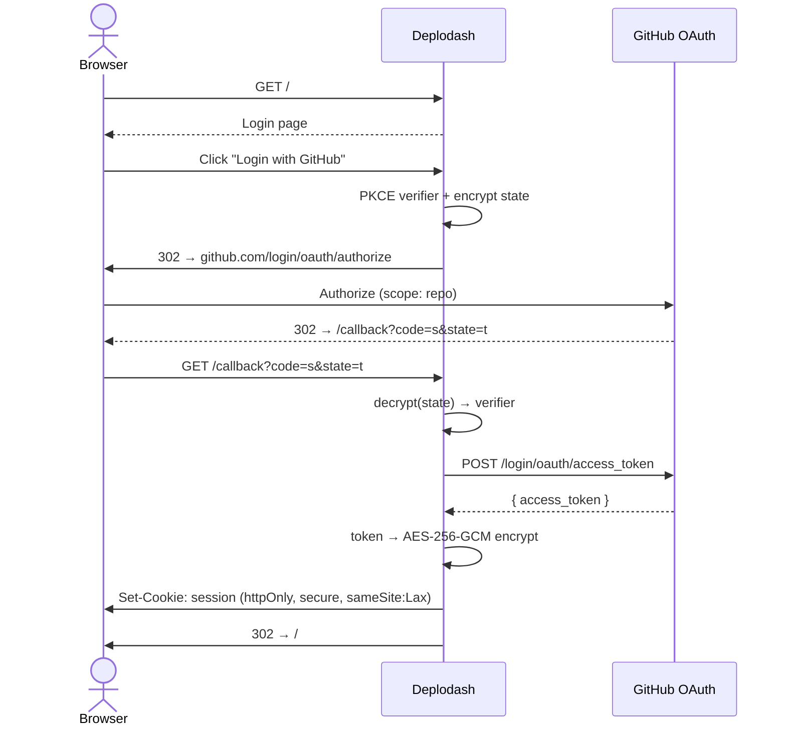
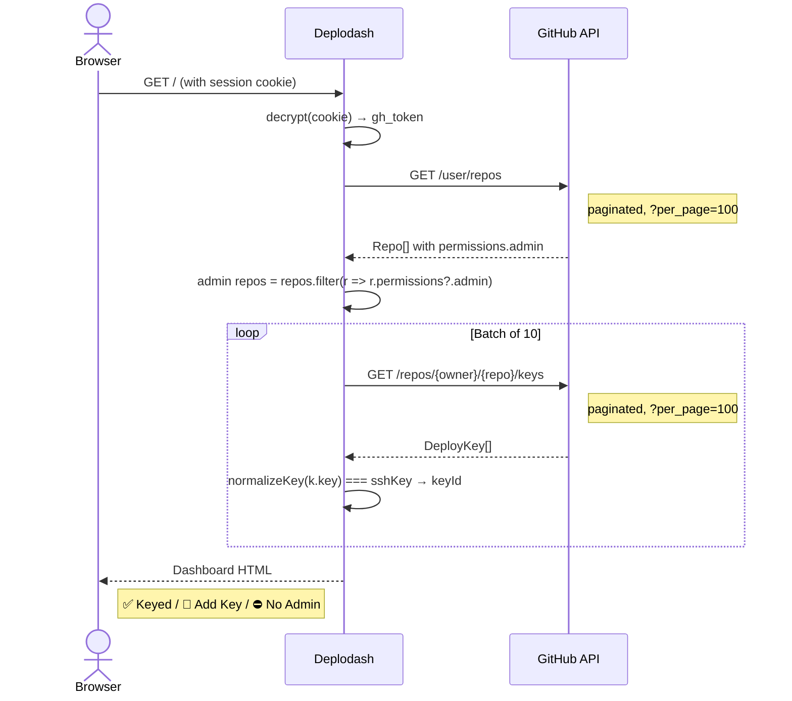
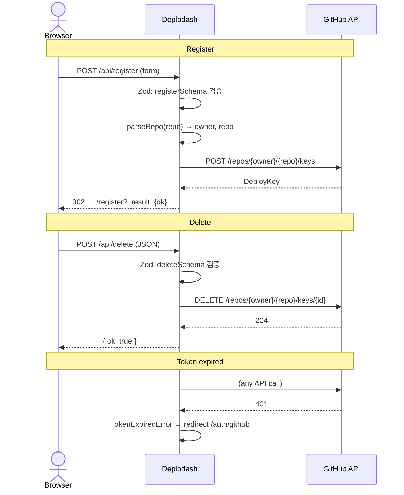
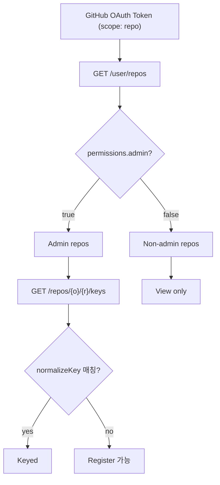

# Deplodash — 인증 및 API 흐름

## 1. 로그인 → 세션 성립

**Deplodash가 하는 일:**

- PKCE verifier + redirect URL을 AES-256-GCM으로 암호화해서 state로 전달
- access_token을 동일한 키로 암호화해서 세션 쿠키에 저장
- `isSafeRedirect()`로 callback의 `next` 파라미터 검증 (open redirect 방어)

---

## 2. 대시보드 — 저장소 스캔

**Deplodash가 하는 일:**

- `normalizeKey()`로 SSH key fingerprint 정규화 후 deploy key 매칭
- 저장소를 10개씩 배치로 스캔 (progress 로깅)
- admin 권한 없는 저장소는 API 호출 없이 "⛔ No Admin" 처리
- `TokenExpiredError` 발생 시 `/auth/github`로 리디렉션

---

## 3. Deploy Key CRUD

**Deplodash가 하는 일:**

- Zod 스키마(registerSchema, deleteSchema, createRepoSchema)로 모든 입력 검증
- GitHub API 401 응답 감지 → TokenExpiredError throw → 302 redirect
- SSH key는 서버에 저장하지 않음 (별도 ssh_key 암호화 쿠키)

---

## 4. 권한 체계

권한 판정은 GitHub API 응답의 `permissions.admin` 필드 기반.

---

## 5. API 엔드포인트

| Endpoint           | Method   | 입력 검증                | GitHub API 호출                      |
| ------------------ | -------- | ------------------------ | ------------------------------------ |
| `/auth/github`     | GET      | Zod (`next`)             | `/login/oauth/authorize` (302)       |
| `/callback`        | GET      | 없음                     | `/login/oauth/access_token`          |
| `/logout`          | GET      | 없음                     | 없음 (쿠키 삭제)                     |
| `/`                | GET      | -                        | `/user/repos`, `/repos/{o}/{r}/keys` |
| `/setup`           | GET/POST | 수동                     | 없음 (SSH key → 쿠키)                |
| `/api/register`    | POST     | Zod (`registerSchema`)   | `POST /repos/{o}/{r}/keys`           |
| `/api/delete`      | POST     | Zod (`deleteSchema`)     | `DELETE /repos/{o}/{r}/keys/{id}`    |
| `/api/create-repo` | POST     | Zod (`createRepoSchema`) | `POST /user/repos`                   |

---

## 6. 보안

| 적용 항목          | 구현 방법                                                        |
| ------------------ | ---------------------------------------------------------------- |
| 세션 쿠키 암호화   | AES-256-GCM + PBKDF2, `httpOnly`, `secure`, `SameSite=Lax`       |
| OAuth state 암호화 | AES-256-GCM (PKCE verifier + redirect URL)                       |
| Open redirect 방어 | `isSafeRedirect()` — `/` 시작, `//` 차단                         |
| CSP                | `default-src 'self'`, `script-src cdn`, `frame-ancestors 'none'` |
| SSH key 저장       | 서버 미저장, 별도 암호화 쿠키 (`ssh_key`)                        |
| XSS 방어           | SSR + `escapeHtml()` (치환 순서: `&` → `<` → `>` → `"` → `'`)    |
| API 입력 검증      | Zod 스키마로 모든 엔드포인트 검증                                |
